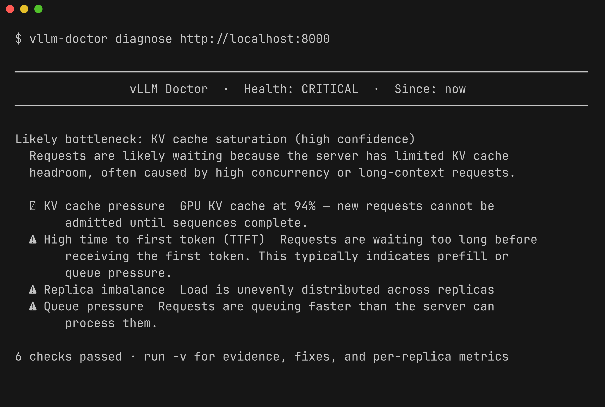

# Introduction


Diagnose vLLM server bottlenecks from live metrics.



vLLM Doctor reads vLLM server metrics and turns them into diagnostic findings: what looks unhealthy, why it may be happening, and which vLLM settings are worth checking first.

```shell
vllm-doctor --url http://localhost:8000/metrics
```

!!! note "Built for incident context"
    vLLM Doctor is not a dashboard replacement or benchmark runner. It is a fast server-side diagnostic snapshot for a single vLLM server or Prometheus target.

## Why not just a dashboard?

Dashboards show metrics. vLLM Doctor explains server-side inference behavior.

|                          | Dashboards | vLLM Doctor |
| ------------------------ | ---------- | ----------- |
| Shows raw metrics        | ✓          | ✓           |
| Explains what's wrong    | ✗          | ✓           |
| Recommends vLLM configs  | ✗          | ✓           |
| Requires setup           | ✓          | ✗           |
| Works on a single server | ✗          | ✓           |

## How does this relate to GuideLLM?

GuideLLM is a good fit for generating workloads and measuring endpoint behavior. vLLM Doctor is a good fit for explaining server-side symptoms from vLLM metrics.

Used together, GuideLLM can create or replay load while vLLM Doctor helps explain bottlenecks such as queue pressure, KV cache pressure, high TTFT, or high TPOT.

## Installation

=== "pip"

    ```shell
    pip install vllm-doctor
    ```

=== "uv"

    ```shell
    uv tool install vllm-doctor
    ```

## Quickstart

=== "Direct scrape"

    ```shell
    vllm-doctor --url http://localhost:8000/metrics
    ```

    !!! note
        Direct scrape mode reads instant gauge values. Latency percentile rules (TTFT, TPOT) are not available — use Prometheus mode for full diagnosis.

=== "Prometheus"

    ```shell
    vllm-doctor --url http://localhost:9090
    ```

## Options

```
Usage: vllm-doctor [OPTIONS]

Options:
  -u, --url      TEXT         URL to diagnose (vLLM /metrics or Prometheus).  [required]
  -w, --window   TEXT         Time window (e.g. '1h', '30m', 'now').  [default: now]
  -f, --format   [text|json]  Output format.  [default: text]
  -v, --verbose               Show additional diagnostic detail.
  -l, --live     INTEGER      Refresh interval in seconds (e.g. --live 10).
  -c, --config   PATH         Path to config file (default: vllm-doctor.toml).
      --help                  Show this message and exit.
```

## Example output

```shell
─────────── vLLM Doctor  ·  Health: CRITICAL  ·  Window: 5m ────────────

╭─ ⚠ Queue pressure  [low confidence] ─────────────────────────────────╮
│   Waiting requests: 7                                                │
│                                                                      │
│   → Add replicas or increase concurrency limits                      │
│   → Inspect autoscaling thresholds                                   │
╰──────────────────────────────────────────────────────────────────────╯
╭─ ✖ KV cache pressure  [high confidence] ─────────────────────────────╮
│   GPU KV cache usage: 94%  ·  Waiting requests: 7                    │
│                                                                      │
│   → Reduce max_num_seqs to limit concurrent sequences                │
│   → Increase gpu_memory_utilization if GPU memory headroom exists    │
╰──────────────────────────────────────────────────────────────────────╯

  Queue Pressure       ⚠ warning     [low]
  KV Cache Pressure    ✖ critical    [high]
  Low Throughput       ✓ ok
  Error Rate           ✓ ok
  High TTFT            ✓ ok

─────────────────────────── Observed Metrics ───────────────────────────

  Requests Running                             12
  Requests Waiting                              7
  GPU Cache Usage        ███████████████████░ 94%
  Decode Tokens/s                            42.0
  TTFT p95 (s)                              3.200
  TPOT p95 (s)                              0.050
```
